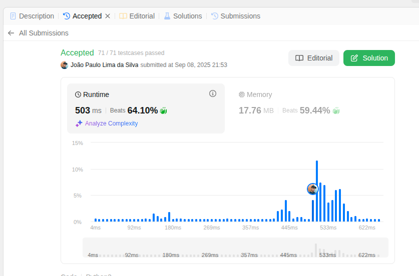

# Algoritmos_Busca_LeetCode

**Número da Lista:** 41  
**Conteúdo da Disciplina:** Algoritmos de Busca

---

## Alunos

| Matrícula  | Aluno                    |
| ---------- | ------------------------ |
| 19/0030755 | João Paulo Lima da Silva |

---

## Sobre

Este projeto tem como propósito a resolução de exercícios da plataforma LeetCode. A iniciativa busca consolidar, por meio da prática, os conceitos teóricos estudados em sala de aula, promovendo o desenvolvimento do raciocínio lógico e da capacidade de resolução de problemas complexos.

---

## Descrição e Screenshots

## [154. Find Minimum in Rotated Sorted Array II DIFÍCIL](https://leetcode.com/problems/find-minimum-in-rotated-sorted-array-ii/description/)

#### [Link do Código](leetcode/154.Find-Minimum-in-Rotated-Sorted-Array-II.py)

## [4. Median of Two Sorted Arrays DIFÍCIL](https://leetcode.com/problems/median-of-two-sorted-arrays/description/)

#### [Link do Código](leetcode/4.Median-of-Two-Sorted-Arrays.py)

## [668. Kth Smallest Number in Multiplication Table DIFÍCIL](https://leetcode.com/problems/kth-smallest-number-in-multiplication-table/description/)

#### [Link do Código](leetcode/668.Kth-Smallest-Number-in-Multiplication-Table.py)

## [33. Search in Rotated Sorted Array MÉDIA](https://leetcode.com/problems/search-in-rotated-sorted-array/description/)

#### [Link do Código](leetcode/33.Search-in-Rotated-Sorted-Array.py)

---

## Instalação

- **Linguagem:** python

---

## Uso

Acesse a plataforma LeetCode, pesquise o número do exercicio, insira o código na área de edição do código e clique em "Run" para executá-lo.

---

## Link da Apresentação

[Link](https://youtu.be/bH3wmizWAQU)
